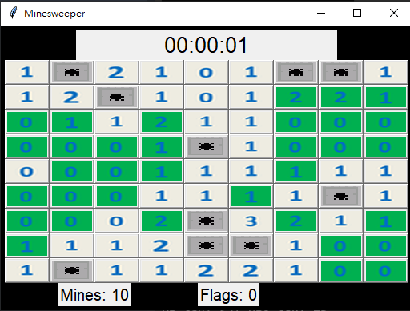

# AI Capstone Project

* Implement an AI agent playing Minesweeper game automatically.
* The agent uses logical inference(the rule of resolution) techniques to solve the game.
* Each cell in the game board is considered as a symbol in the propositional logic.

## Run the Game Agent

``` 
> python3 minesweepr.py
```